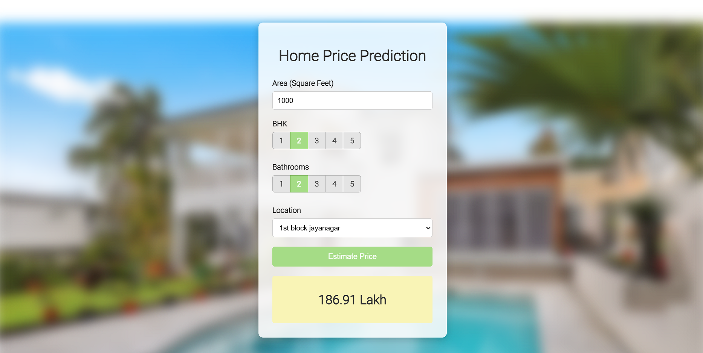

# Bengaluru Home Price Prediction



This project demonstrates building a **real estate price prediction website** for Bengaluru home prices. The project involves creating a **machine learning model** using **scikit-learn** and linear regression, trained on the Bengaluru home prices dataset from Kaggle. A **Python Flask server** serves the model via HTTP requests, and a **frontend website** built with HTML, CSS, and JavaScript allows users to input home details (square footage, number of bedrooms, bathrooms, and location) to get predicted prices.

The model-building process covers essential data science concepts, including **data loading and cleaning**, **outlier detection and removal**, **feature engineering**, **dimensionality reduction**, **GridSearchCV for hyperparameter tuning**, and **k-fold cross-validation**.

## Technologies and Tools Used

- **Python**
- **NumPy** and **Pandas** for data cleaning
- **Matplotlib** for data visualization
- **Scikit-learn** for model building
- **Jupyter Notebook**, **Visual Studio Code**, and **PyCharm** as IDEs
- **Python Flask** for the HTTP server
- **HTML, CSS, and JavaScript** for the frontend

## Features

- Predicts home prices based on area, BHK, bathrooms, and location
- Interactive and responsive frontend UI
- Uses a trained machine learning model for accurate predictions
- Displays predicted price instantly after user input

## Project Structure

```
/client (frontend)
    index.html
    index.css
    index.js

/server (backend)
    server.py
    util.py
    requirements.txt
    /artifacts
        bangalore_house_prices_model.pickle
        columns.json
```

## How to Run Locally

1. **Clone the repository** containing both frontend and backend (or backend only if separated):
   ```bash
   git clone <repository-url>
   ```

2. **Navigate to the backend folder:**
   ```bash
   cd server
   ```

3. **Install required Python packages:**
   ```bash
   pip install -r requirements.txt
   ```

4. **Start the Flask server:**
   ```bash
   python server.py
   ```
   The server runs on `http://localhost:5000` by default.

5. **Open the frontend:** 
   - Open `client/index.html` in a browser, or
   - Serve the frontend using a local HTTP server (e.g., `python -m http.server`) to enable AJAX requests to the Flask backend.

## Future Improvements

- Deploy the application to Render or Heroku for live access
- Add frontend visualizations, such as price trends by location
- Implement authentication for user-specific features


Live Demo - https://organiclemon1.github.io/BengaluruHousePrediction/
